# Guidora System Architecture

```mermaid
graph TB
    %% User Interface Layer
    subgraph Frontend["Frontend Layer"]
        UI[Web Interface]
        Templates[Django Templates]
        Static[Static Files]
    end

    %% Application Layer
    subgraph Apps["Application Layer"]
        %% Accounts Module
        subgraph Accounts["Accounts Module"]
            Auth[Authentication]
            Profile[Profile Management]
            UserTypes[Student Types]
        end

        %% Assessment Module
        subgraph Assessment["Assessment Module"]
            Aptitude[Aptitude Test]
            Personality[Personality Test]
            CareerRec[Career Recommender]
        end

        %% Resume Module
        subgraph Resume["Resume Analysis Module"]
            Parser[Resume Parser]
            Skills[Skills Extractor]
            ATS[ATS Scorer]
        end

        %% College Module
        subgraph College["College Module"]
            CollegeInfo[College Information]
            Courses[Course Details]
            Rankings[College Rankings]
        end
    end

    %% Data Layer
    subgraph Data["Data Layer"]
        DB[(Database)]
        ML[ML Models]
        JSON[JSON Data Files]
    end

    %% External Services
    subgraph External["External Services"]
        NLTK[NLTK]
        scikit[Scikit-learn]
    end

    %% Connections
    UI --> Templates
    Templates --> Static
    
    %% Auth Flow
    UI --> Auth
    Auth --> DB
    
    %% Profile Flow
    UI --> Profile
    Profile --> UserTypes
    UserTypes --> DB
    
    %% Assessment Flow
    UI --> Aptitude
    UI --> Personality
    Aptitude --> DB
    Personality --> DB
    CareerRec --> ML
    CareerRec --> JSON
    
    %% Resume Flow
    UI --> Parser
    Parser --> Skills
    Parser --> ATS
    Skills --> JSON
    
    %% College Flow
    UI --> CollegeInfo
    CollegeInfo --> DB
    Courses --> DB
    Rankings --> DB
    
    %% External Dependencies
    Parser --> NLTK
    CareerRec --> scikit

    %% Data Flow
    DB --> Apps
    ML --> Apps
    JSON --> Apps

    classDef primary fill:#f9f,stroke:#333,stroke-width:2px
    classDef secondary fill:#bbf,stroke:#333,stroke-width:2px
    classDef data fill:#dfd,stroke:#333,stroke-width:2px
    classDef external fill:#fdd,stroke:#333,stroke-width:2px
    
    class UI,Templates,Static primary
    class Auth,Profile,UserTypes,Aptitude,Personality,CareerRec,Parser,Skills,ATS,CollegeInfo,Courses,Rankings secondary
    class DB,ML,JSON data
    class NLTK,scikit external
```

## Architecture Overview

### Frontend Layer
- **Web Interface**: Django-based web interface
- **Templates**: Django template system for rendering views
- **Static Files**: CSS, JavaScript, and other static assets

### Application Layer

#### Accounts Module
- **Authentication**: User authentication and authorization
- **Profile Management**: User profile handling
- **Student Types**: School and College student type management

#### Assessment Module
- **Aptitude Test**: Technical and analytical skills assessment
- **Personality Test**: Personality traits assessment
- **Career Recommender**: ML-based career recommendation system

#### Resume Analysis Module
- **Resume Parser**: Document parsing (PDF/DOCX)
- **Skills Extractor**: Skills identification and extraction
- **ATS Scorer**: Resume scoring and analysis

#### College Module
- **College Information**: College details and data
- **Course Details**: Available courses and programs
- **College Rankings**: Ranking and comparison system

### Data Layer
- **Database**: PostgreSQL database for persistent storage
- **ML Models**: Trained machine learning models
- **JSON Data Files**: Static data for skills and career paths

### External Services
- **NLTK**: Natural Language Processing
- **Scikit-learn**: Machine Learning functionality 